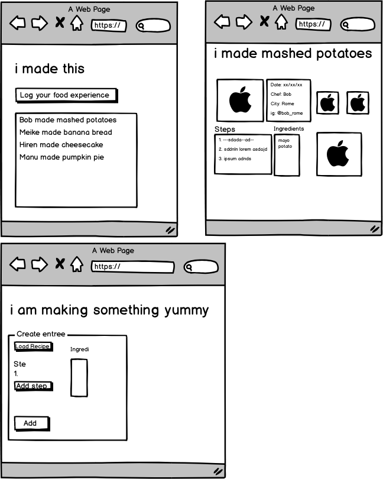

# imadethis-vue

This is the frontend for imadethis, which is a recipe logging app. The backend is made with node.js. 
See: https://github.com/Hersh3yy/imadethis-nodejs


### Intended wireframe



## Project setup
```
yarn install
```

### Compiles and hot-reloads for development
```
yarn run serve
```

### Compiles and minifies for production
```
yarn run build
```

### Run your tests
```
yarn run test
```

### Lints and fixes files
```
yarn run lint
```
